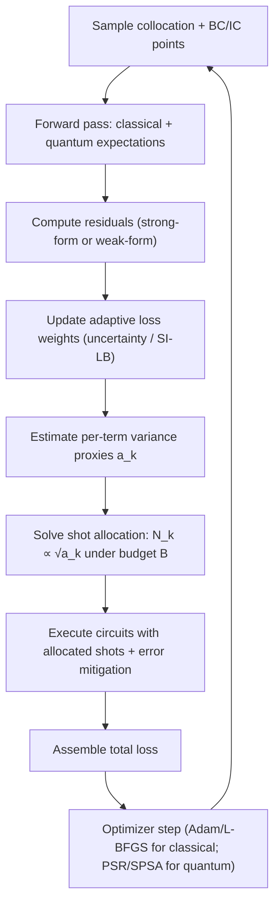

# Differentiable Hybrid Classical–Quantum PINN for 2D Phase‑Field Crystal Growth

## Executive summary

A trainable hybrid classical–quantum physics‑informed neural network (QPINN) for 2D crystal growth with outputs \((u,v,p,c,\phi)\) becomes credible only when the quantum layer is **differentiable** (both w.r.t. its trainable circuit parameters and, for PINN residuals, w.r.t. the coordinate inputs). Many prototypes fail evaluating circuits “out of graph” (e.g., by detaching tensors, converting to NumPy, or using non‑differentiable runners), which prevents backpropagating PDE residuals through the quantum component and removes shot/noise realism. A practical upgrade is to use **primitive‑based differentiable QNN layers** (e.g., estimator‑expectation QNNs integrated with PyTorch) and explicitly enable *input gradients* when needed. citeturn15search1turn15search14turn15search9

The most directly reusable classical baseline for CZ‑style thermal–fluid coupling is the improved SI‑LB‑PINN idea: (i) inject “spatial information” repeatedly inside hidden layers and (ii) learn adaptive loss weights via an uncertainty‑motivated likelihood objective. The 2025 CZ paper reports that this combination substantially improves stability and boundary accuracy, with relative error reductions on the order of 10–100× versus several compared PINN variants in their benchmarks. citeturn11view2turn11view4turn9view0

For the quantum upgrade, the core design principle that makes **10–16 qubits with fewer shots** mathematically defensible is: keep outputs as **local observables** (e.g., single‑qubit Pauli‑\(Z\) expectations), and keep circuits **shallow but wider** (width ≈ 10–16 qubits, depth scaled modestly). Local observables support better trainability than global cost constructions and can avoid the worst barren‑plateau scaling reported for random/global settings. citeturn4search0turn4search1

Finally, “fewer shots” is not an article of faith: it should be a **resource‑allocation decision**. For PINNs, the loss is a weighted sum of multiple physics residuals and constraints; you can pose shot allocation as a constrained optimization problem minimizing a gradient‑variance proxy subject to a shot budget. This yields closed‑form “square‑root” allocations similar to shot‑assignment results studied in variational algorithms, and it naturally couples to SI‑LB‑style adaptive weighting: as the loss weights evolve, the optimal shot distribution evolves too. citeturn3search10turn3search22turn11view4

## Physics model and SI‑LB‑PINN baseline translated to the crystal‑growth QPINN setting

A physics‑informed network \(\mathbf{y}(x,y)=(u,v,p,c,\phi)\) is consistent with a widely used multiphysics structure: incompressible flow (continuity + momentum) coupled to solute/concentration transport and a diffuse‑interface phase‑field description of solidification/growth. Classic phase‑field solidification models use an order parameter \(\phi\) and diffusion fields (e.g., temperature/solute) to avoid explicit interface tracking; convection‑coupled formulations are standard for melt flow effects, which is especially relevant to CZ‑like growth contexts. citeturn12search6turn12search3turn12search11

A representative strong‑form residual set (schematic) for 2D may be organized as
\[
\mathcal{R}_\text{cont}=\nabla\cdot \mathbf{u},\quad
\mathcal{R}_\text{mom}=\rho(\mathbf{u}\cdot\nabla)\mathbf{u}+\nabla p-\mu \nabla^2\mathbf{u}-\mathbf{f}(\phi,c),
\]
\[
\mathcal{R}_c=\mathbf{u}\cdot\nabla c-\nabla\cdot(D(\phi)\nabla c)+S_c(\phi,c),
\quad
\mathcal{R}_\phi=\mathbf{u}\cdot\nabla \phi-\mathcal{G}(\phi,c,\nabla\phi,\nabla^2\phi),
\]
where \(\mathcal{G}\) is chosen according to the phase‑field variant (conserved vs. non‑conserved order parameter), and \(\mathbf{f}\) may include diffuse‑interface forcing (e.g., drag in the interfacial zone that enforces no‑slip in the solid, or capillarity‑related terms depending on the chosen formulation). This style of coupling (phase‑field + convection) has a long modeling lineage and appears explicitly in convection‑solidification phase‑field simulation literature. citeturn12search3turn12search11turn12search2

A key “possible error” in many simplified phase‑field PINN notebooks is silently picking a conserved (Cahn–Hilliard‑type) evolution for \(\phi\) while still training only \(\phi\) (without the chemical potential) and then needing higher‑order derivatives (fourth order) in the residual, which is expensive and numerically stiff—especially problematic when the function is produced by a shot‑based quantum layer. A conceptually cleaner choice for near‑term QPINNs is either (a) a **non‑conserved** phase‑field evolution (second‑order operator) or (b) splitting the conserved model into coupled second‑order residuals by introducing an auxiliary chemical potential field (increasing outputs). This is also why *variational/weak‑form* PINNs are particularly attractive for quantum layers: they reduce derivative order through integration by parts. citeturn14search3turn12search2

The 2025 CZ paper’s SI‑LB‑PINN logic is directly transferable as a classical backbone:

- **Spatial information injection:** rather than letting coordinate derivatives “wash out” with depth, the network repeatedly re‑introduces coordinate information inside hidden layers using nonlinear encoders and gating; the paper gives explicit hidden‑layer constructions (Eqs. (14)–(16) in their text). citeturn11view2turn11view1  
- **Adaptive loss balancing:** they model outputs (and/or constraint terms) probabilistically with Gaussian likelihoods and optimize uncertainty parameters \(\varepsilon\) alongside network weights to rebalance PDE/BC/data losses (their Eqs. (17)–(21) mirror uncertainty weighting ideas from multi‑task learning). citeturn11view4turn14search2  
- **Empirical payoff:** in their benchmarks (natural convection cavity and CZ application), SI‑LB‑PINN improves boundary fidelity and reduces reported relative errors by roughly one to two orders of magnitude compared with several baseline and enhanced PINNs. citeturn9view0turn11view0

The hybrid QPINN proposal below keeps SI‑LB‑style spatial injection and uncertainty weights *classical*, and inserts a quantum feature module where it provides maximum “capacity per parameter” without forcing high‑order derivatives through shot noise.


## Differentiable quantum layer designs for 10–16 qubits with parameter‑shift gradients

### Design constraints that matter for PINNs

A strong‑form PINN relies on differentiating network outputs w.r.t. coordinates to form PDE residuals; this is easy for classical networks via automatic differentiation, but for shot‑based quantum circuits the derivative must be computed from circuit evaluations. The known analytic route is the **parameter‑shift rule**, which estimates \(\partial_{\theta}\langle O\rangle\) using shifted circuits for many common single‑parameter rotation gates. citeturn0search2turn15search0

For general gates (or higher‑order derivatives), generalizations exist that still reduce derivatives to shifted expectation evaluations; importantly, the cost of these rules and their resource tradeoffs are analyzed in modern parameter‑shift literature, including explicit higher‑order derivative (Hessian) recipes. citeturn16search2turn16search0

This leads to a near‑term QPINN architecture choice:

- Make the quantum circuit output **only local observables** (single‑qubit \(Z\) expectations or small local Pauli strings) so measurement variance remains bounded and trainability is closer to the “local cost” regime discussed in barren‑plateau analyses. citeturn4search1turn4search0  
- Increase expressivity primarily through **width (10–16 qubits)** and structured shallow entanglement (ring/brickwall/tree) rather than very deep circuits. This reduces gate error accumulation and helps keep gradients usable. citeturn1search5turn4search1  
- Use **data re‑uploading** and/or repeated coordinate injection to compensate for shallow depth while approximating complex spatial dependencies. citeturn4search2turn11view2

### Three concrete ansatz families suitable for 10–16 qubits

Below are circuit *descriptions* (parameter‑shift compatible by construction because all trainable gates are single‑parameter rotations with Pauli generators). Each can be instantiated at \(n\in\{10,12,14,16\}\) qubits.

#### Hardware‑efficient ring ansatz with re‑uploading (HEA‑Ring‑RU)

**Idea:** alternate (i) coordinate‑dependent encoding rotations and (ii) trainable rotations, then entangle with a ring of 2‑qubit gates.

Layer \(\ell=1,\dots,L\) (typical \(L=2\)–4):
1. Encoding: for each qubit \(i\),
   \[
   R_y\!\big(a_{\ell,i}x+b_{\ell,i}y+\beta_{\ell,i}\big)\;R_z\!\big(c_{\ell,i}x+d_{\ell,i}y+\gamma_{\ell,i}\big)
   \]
   where the affine coefficients may be produced by a classical encoder (so they remain differentiable classically) or partially learned. Data re‑uploading style improves expressive power even with shallow circuits. citeturn4search2turn4search3  
2. Trainable block: for each qubit \(i\), apply \(R_y(\theta_{\ell,i})R_z(\varphi_{\ell,i})\).  
3. Entangle: apply CZ (or CX) on edges \((0,1),(1,2),\dots,(n-2,n-1),(n-1,0)\).

Readout: measure \(Z\) on 5 designated “head” qubits to represent \((u,v,p,c,\phi)\) (or measure \(Z\) on all qubits and use a learned linear map to 5 outputs); all \(Z_i\) commute, so one measurement basis gives all heads simultaneously. citeturn3search1turn4search1

#### Brickwork/nearest‑neighbor ansatz (HEA‑Brick‑Local)

**Idea:** same as HEA‑Ring‑RU but with a brickwork entangler to reduce entangling depth and crosstalk sensitivity.

Entangler pattern per layer (two sublayers):
- sublayer A: CZ on \((0,1),(2,3),\dots\)
- sublayer B: CZ on \((1,2),(3,4),\dots\)

This typically reduces two‑qubit gate depth compared with full connectivity; it’s a common “hardware‑respecting” choice when noise is not specified. Randomized compiling results also strongly motivate respecting native architectures and keeping coherent error components controllable. citeturn1search5turn1search25

#### Tree tensor / log‑depth pooling ansatz (TTN‑Pool)

**Idea:** make depth \(\mathcal{O}(\log n)\) by entangling qubits in a tree and “pooling” information into a smaller readout set.

Structure for \(n=16\):
- level 1: entangle pairs (0,1),(2,3),…,(14,15)
- level 2: entangle (0,2),(4,6),…,(12,14)
- level 3: entangle (0,4),(8,12)
- level 4: entangle (0,8)

Between levels, apply parameterized single‑qubit rotations on all active qubits. Read out the top 5 qubits (or distribute heads across the tree). The key point is depth grows slowly with \(n\), which is helpful once 2‑qubit errors dominate. citeturn1search5turn17search1

### Ansatz comparison table for 10–16 qubits

Assume:
- \(n\) qubits, \(L\) layers (or \(L\) “rounds” for TTN),
- each layer uses two trainable rotations per qubit (\(R_y,R_z\)),
- outputs are 5 local \(Z\) expectations measured in one basis.

| Ansatz (10–16 qubits) | Entanglement topology | Two‑qubit gates per layer (≈) | Depth scaling | Trainable params \(P\) (≈) | Parameter‑shift gradient circuit count (per forward) | Notes on trainability/noise |
|---|---:|---:|---:|---:|---:|---|
| HEA‑Ring‑RU | ring | \(n\) | \(\mathcal{O}(L)\) | \(2nL\) | \(2P\) | Strong baseline; local‑observable heads help avoid global barren‑plateau regime. citeturn4search1turn0search2 |
| HEA‑Brick‑Local | brickwork NN | \(\approx n\) but often smaller 2‑q depth | \(\mathcal{O}(L)\) | \(2nL\) | \(2P\) | Better hardware locality; pairs well with randomized compiling. citeturn1search5turn1search25 |
| TTN‑Pool | tree | \(\approx n-1\) across all levels | \(\mathcal{O}(L\log n)\) | \(\approx 2nL\) | \(2P\) | Depth advantage for 16 qubits; restricts entanglement structure but often easier on noise. citeturn17search1turn4search1 |

**Expected fidelity proxy (parameterized):** if single‑qubit gate error \(\epsilon_1\) and two‑qubit gate error \(\epsilon_2\) are treated as effective depolarizing strengths, a rough multiplicative proxy is
\[
F_\text{proxy} \approx (1-\epsilon_1)^{N_1}(1-\epsilon_2)^{N_2},
\]
so at fixed \(L\), increasing \(n\) mainly increases \(N_2\) linearly for ring/brickwork (vs. quadratically for full‑connectivity), which is why “wider shallow” circuits are the realistic scaling choice under unspecified noise. This is consistent with the broader quantum‑error‑mitigation literature emphasizing bias from noise accumulation and the need for mitigation/smart compilation rather than assuming deep circuits are viable. citeturn17search1turn1search5turn17search0

### How this connects to published QPINN/QCPINN evidence

Existing quantum‑classical PINN studies often report that hybrid designs can match classical accuracy with far fewer trainable parameters, especially with angle encoding and structured circuit topologies. A 2025 “QCPINN” study reports up to ~89% parameter reductions while maintaining comparable PDE solution quality across multiple test PDEs, and finds some DV (qubit) circuit configurations more stable than others. citeturn18view0

Separate QPINN benchmarking papers (including hybrid QPINN variants for flow problems and multiple PDE settings) further support that the practical objective in NISQ regimes is not “pure quantum speedup,” but *parameter efficiency / representation efficiency under noise and limited sampling*. citeturn13search9turn13search10turn13search27

## Shot‑noise scaling, adaptive shot allocation, and why “fewer shots + larger circuits” can be optimal

### Shot noise for local expectation values

If each output head is an expectation of a Pauli observable \(O\) with eigenvalues \(\pm 1\) (e.g., \(Z_i\)), then a single measurement is a Bernoulli‑like \(\pm 1\) random variable with mean \(\mu=\langle O\rangle\). The empirical estimator \(\hat{\mu}\) over \(N\) shots satisfies
\[
\mathrm{Var}(\hat{\mu}) = \frac{1-\mu^2}{N}\le \frac{1}{N}.
\]
This bounded‑variance property is a major reason to design QPINN outputs as local Pauli expectations (not complicated global observables). Shot‑allocation and measurement‑reduction literature in variational algorithms uses this exact variance/budget logic. citeturn3search10turn3search22turn3search3

Crucially, this variance bound is **independent of the qubit count \(n\)**; increasing width does not inherently worsen shot noise for a fixed local observable. What *does* grow with width is circuit execution cost and accumulated gate noise, which is managed by shallow depth and mitigation. citeturn1search5turn17search1

### Parameter‑shift gradients and their sampling cost

For common single‑parameter gates \(U(\theta)=e^{-i\theta G}\) where \(G\) has two eigenvalues (typical Pauli‑rotation generators), the parameter‑shift rule gives
\[
\frac{\partial}{\partial \theta}\langle O\rangle(\theta) = \frac{1}{2}\Big(\langle O\rangle(\theta+s)-\langle O\rangle(\theta-s)\Big),
\quad s=\frac{\pi}{2},
\]
so a gradient component can be obtained from two shifted circuit evaluations. This is the basis of analytic gradient estimation on hardware. citeturn0search2turn15search0

For more general gates and for higher‑order derivatives (needed if you insist on strong‑form residuals involving second derivatives), general parameter‑shift families and higher‑order derivative recipes exist; however, their estimator variance and circuit‑evaluation counts become part of your resource budget. citeturn16search2turn16search0turn16search1

### Adaptive shot allocation as a constrained optimization problem

Let the overall PINN loss be a weighted sum of \(K\) components,
\[
\mathcal{L}=\sum_{k=1}^K \lambda_k \,\mathcal{L}_k,
\]
where \(\mathcal{L}_k\) may represent continuity, momentum, solute transport, phase‑field residuals, plus BC/IC penalties. Weighted multi‑task losses are central both in classical PINNs and in SI‑LB‑PINN. citeturn11view0turn11view4turn14search2

Assume (a common approximation in shot‑allocation work) that the noisy gradient estimate contribution from each component can be modeled with a variance proxy
\[
\mathrm{Var}(\widehat{\nabla\mathcal{L}})\ \approx\ \sum_{k=1}^K \frac{a_k}{N_k},
\]
where \(N_k\) is the number of shots assigned to estimating component \(k\), and \(a_k\) aggregates the squared weight \(\lambda_k^2\) and intrinsic variance factors of the corresponding observable/gradient estimator. This functional form underlies many “minimize variance given a shot budget” strategies in variational measurement allocation. citeturn3search10turn3search22turn3search3

Now impose a per‑iteration shot budget:
\[
\sum_{k=1}^K N_k \le B,\quad N_k\ge 0.
\]

**Resource allocation problem:**
\[
\min_{\{N_k\}} \sum_{k=1}^K \frac{a_k}{N_k}\quad \text{s.t.}\quad \sum_{k=1}^K N_k = B.
\]

Using Lagrange multipliers, the optimum satisfies:
\[
N_k^\star=\frac{B\,\sqrt{a_k}}{\sum_{j=1}^K \sqrt{a_j}}
\quad\Rightarrow\quad
\min \mathrm{Var} = \frac{\Big(\sum_{k=1}^K \sqrt{a_k}\Big)^2}{B}.
\]

This delivers two actionable consequences:

1. **Shots should track the square root of “importance.”** If SI‑LB‑style adaptive weights \(\lambda_k\) increase the effective importance of a residual term, the optimal shot allocator automatically increases \(N_k\) (because \(a_k\) increases). This makes shot scheduling and adaptive loss balancing mathematically aligned rather than separate heuristics. citeturn11view4turn14search2turn3search22  
2. **You can justify few shots early, more shots late.** Early in training, \(a_k\) and the gradient norms are large and noisy optimization is tolerable; later, to refine convergence, you increase total \(B\) or re‑allocate toward the stiffest residuals. Dynamic shot optimization methods in the variational‑algorithm literature explicitly pursue this “allocate shots based on distribution/variance” principle. citeturn3search32turn3search10

### Why “larger circuits + fewer shots” can be optimal in PINN residual estimation

Under a fixed compute budget, you’re trading off:

- **Approximation bias**: too small a model (insufficient capacity) yields a residual floor no matter how many shots you take. Hybrid Q(P)INN evidence often reports that structured quantum circuits can deliver comparable performance with fewer parameters (i.e., improved representational efficiency). citeturn18view0turn13search27turn13search9  
- **Sampling variance**: too few shots yields noisy residual/gradient estimates scaling like \(1/N\). citeturn3search22

A simple way to formalize the “wider, fewer shots” intuition is a bias–variance model for a residual estimator:
\[
\mathbb{E}\big[(\widehat{\mathcal{R}}-\mathcal{R}^\star)^2\big] \approx \underbrace{\mathrm{Bias}(n,L)^2}_{\text{model capacity}} + \underbrace{\frac{C}{B}}_{\text{shot-limited variance}},
\]
where \((n,L)\) denote circuit width/depth and \(B\) is the allocated shots. If increasing \(n\) (at shallow depth) reduces Bias substantially—empirically consistent with “parameter efficiency” findings in QCPINN‑style studies—while variance decreases only linearly with added shots, then at finite budgets it can be optimal to invest in a more expressive circuit (higher \(n\)) while keeping shots modest and relying on adaptive shot scheduling near convergence. citeturn18view0turn3search10turn3search22

This is also consistent with trainability theory: barren‑plateau results warn that increasing qubits with unstructured/global costs can make gradients exponentially small, but later work shows the phenomenon is **cost‑function dependent**, and local costs can avoid the worst scaling for shallow circuits. QPINN designs that keep outputs as local observables and losses as sums of local residual terms are therefore aligned with the “local cost” regime. citeturn4search0turn4search1

### Plots: example shot allocation vs. gradient‑variance proxy

The following plots illustrate (with a representative set of residual‑importance coefficients \(a_k\)) how optimal “square‑root” allocation improves a gradient‑variance proxy compared with uniform shot allocation, and how shots are distributed across residual groups.

- [shot_allocation_variance.png](sandbox:/mnt/data/shot_allocation_variance.png)  
- [shot_allocation_fractions.png](sandbox:/mnt/data/shot_allocation_fractions.png)

These plots are a visualization of the constrained minimization above, consistent with variance‑minimizing shot assignment analysis in variational measurement literature. citeturn3search10turn3search22

## Error‑mitigation stack for low‑shot, 10–16 qubit QPINNs

Noise is unavoidable for 10–16 qubits on NISQ hardware, and error mitigation (QEM) is explicitly positioned as a practical pathway to reduce noise‑induced bias without full fault tolerance. citeturn17search1turn17search0

Below is a stack tailored to QPINNs where you repeatedly estimate **local expectation values** under limited shots.

### Readout (measurement) error mitigation

**What it is:** correct bias from classical readout errors by estimating a calibration/assignment map and applying its inverse (or a model‑free variant) to measured bitstring frequencies. citeturn17search5turn1search7

**Implementation steps (scales to 10–16 qubits):**
1. Prefer **factorized / local calibration** (per‑qubit or small blocks), not full \(2^n\times 2^n\) inversion, which is infeasible at \(n=16\). Efficient calibration via randomized bit‑flips is one scalable approach. citeturn17search13  
2. Fit the calibration model (assignment probabilities) and apply correction to the observed distribution; optionally regularize inversion to control variance blow‑up. citeturn1search7turn17search5  
3. Validate with a small set of known circuits (e.g., prepare \(|0\dots0\rangle\), \(|1\dots1\rangle\), GHZ subsets) to sanity‑check bias reduction.

**Expected improvement:** readout mitigation primarily reduces **systematic bias** in \(\langle Z_i\rangle\) estimates; empirical studies show it can substantially improve agreement with expected distributions and is considered “standard practice” in many workflows (though gains are device‑dependent). citeturn17search13turn17search21

### Randomized compiling (noise tailoring)

**What it is:** insert randomized single‑qubit operations (Cliffords/Paulis with compensating corrections) so coherent errors are converted into effective stochastic noise that averages more benignly. This reduces worst‑case error accumulation and makes performance more predictable. citeturn1search5turn1search1

**Implementation steps:**
1. For each logical circuit, generate \(R\) randomized variants via a randomized compiling pass. citeturn1search5  
2. Execute all \(R\) variants with the same shot count (or allocate shots within the same global shot scheduler).  
3. Average expectation estimates across variants.

**Expected improvement:** theory predicts dramatic reductions in worst‑case errors under coherence; experiments on superconducting processors report significant performance gains for benchmark algorithms and random circuits. citeturn1search5turn1search25

### Zero‑noise extrapolation (ZNE)

**What it is:** evaluate the same observable at multiple amplified noise levels and extrapolate back to the zero‑noise limit (often via Richardson extrapolation). citeturn1search28turn1search0

**Implementation steps:**
1. Choose noise scale factors \(s_1=1<s_2<\dots<s_m\) by circuit folding (global or local). citeturn1search24turn1search28  
2. Run the folded circuits, obtain expectation estimates \(\hat{\mu}(s_j)\).  
3. Extrapolate \(\hat{\mu}(0)\) by fitting a low‑order model (linear/quadratic) or using Richardson coefficients.

**Expected improvement (and caveat):** ZNE can reduce bias, but it increases estimator variance (noise amplification + repeated evaluations). Recent analyses emphasize the bias–variance tradeoff and the risk of overfitting extrapolation under finite shots; therefore, ZNE should be applied selectively (e.g., late training, stiff residuals, or validation) rather than everywhere. citeturn1search28turn1search20turn1search24

### Symmetry verification (post‑selection / projection)

**What it is:** enforce known conserved symmetries by discarding (or projecting out) measurement outcomes that violate them. Demonstrations show substantial error reductions in certain workloads, including reports of up to order‑of‑magnitude improvements in some simulated settings and experimental improvements in VQE contexts. citeturn1search6turn1search26turn1search2

**Implementation steps for QPINNs:**
1. Choose a symmetry that your circuit is designed to preserve. For QPINNs, the most practical are **parity‑type or fixed‑subspace encodings** you impose intentionally (e.g., enforce even \(Z\)-parity on a latent register). citeturn1search6turn17search23  
2. Measure the symmetry operator (often computable from the same bitstrings if it is diagonal in the measurement basis) and post‑select shots satisfying the symmetry.  
3. Renormalize expectation estimates using the accepted shots, and propagate the reduced effective shot count into the shot scheduler.

**Expected improvement:** symmetry verification reduces bias from errors that leak out of the symmetry subspace, but it trades against sample efficiency (you may discard many shots). Extensions like symmetry expansion explicitly analyze the bias–sampling cost tradeoff. citeturn1search6turn17search23

## Differentiable implementations and a training loop with adaptive shot scheduling

### Implementation options for a trainable quantum layer

#### Option A: EstimatorQNN + TorchConnector (PyTorch integration)

This is the most direct “upgrade path” when you want a differentiable quantum module inside a PyTorch model: the estimator‑based QNN outputs expectation values and supports parameter‑shift gradients. If you need gradients w.r.t. input data (for PINN residual derivatives), you must explicitly enable `input_gradients=True` in the QNN before wrapping it. citeturn15search1turn15search14turn15search9

**What it’s best for:** forward + first‑order gradients (weights and inputs) as supported by the QNN framework and gradient backend. citeturn15search21turn15search0

**Practical caution for PINNs:** strong‑form PDEs often require *second* derivatives w.r.t. coordinates; parameter‑shift can compute higher‑order derivatives, but you generally cannot rely on automatic higher‑order backprop through a shot‑based estimator. For second‑order spatial derivatives, you need explicit higher‑order shift rules or an alternative PINN formulation (weak form / first‑order system). citeturn16search0turn14search3

**Pseudocode (conceptual):**
```python
# Build circuit = feature_map(inputs) ∘ ansatz(weights)
# Define observables for 5 outputs (Z on 5 head qubits, or a small set of Pauli strings)

qnn = EstimatorQNN(
    circuit=qnn_circuit,
    input_params=phi_in,      # parameters bound to encoded (x,y) or learned angles
    weight_params=theta_w,    # trainable PQC parameters
    observables=obs_list,
    input_gradients=True      # critical for hybrid backprop
)
qlayer = TorchConnector(qnn)  # becomes a torch.nn.Module
```
(EstimatorQNN/TorchConnector mechanics and the requirement to set `input_gradients=True` are explicitly documented.) citeturn15search1turn15search14turn15search9

#### Option B: Explicit parameter‑shift engine (manual control + custom shot scheduler)

If you need full control over (i) which partial derivatives are computed, (ii) how many shots each evaluation receives, and (iii) how error mitigation is applied, implement a “differentiable” quantum layer as a custom function that returns both values and gradients using parameter‑shift evaluations.

This is especially appropriate for PINNs, because you can embed the *adaptive shot allocator* directly into the gradient computation, and you can compute higher‑order derivatives using higher‑order parameter‑shift rules when necessary. citeturn0search2turn16search0turn16search2

**Core primitive (first derivative):**
- For each parameter \(\theta_j\), evaluate \(f(\theta_j+s)\) and \(f(\theta_j-s)\) and take the half‑difference. citeturn0search2

**Higher‑order derivatives (when unavoidable):**
- Use analytic higher‑order parameter‑shift constructions rather than naive finite differences; resources and MSE tradeoffs are analyzed in higher‑order derivative work. citeturn16search0turn16search2turn16search3

#### Option C: SPSA (two evaluations per step, parameter‑count independent)

Simultaneous perturbation stochastic approximation (SPSA) estimates gradients from only **two objective evaluations** per step, independent of parameter dimension, which is attractive for low‑shot regimes with many parameters. citeturn2search4turn2search14turn2search1

The tradeoff is higher gradient variance and sensitivity to hyperparameters, so SPSA is often most useful when parameter‑shift evaluation count is prohibitive or when shot budgets are extremely tight. citeturn2search14turn16search1

### Training loop integrating PINN residuals + SI‑LB loss balancing + shot scheduler

A robust training loop for \((u,v,p,c,\phi)\) aims to combine three adaptivity layers:

1. **SI‑LB adaptive loss weights** \(\lambda_k(\varepsilon)\) (learned uncertainty parameters) to balance PDE residuals, BC/IC constraints, and possibly data. citeturn11view4turn14search2  
2. **Adaptive collocation sampling** (optional): importance sampling collocation points proportional to residual magnitude to focus computation where the physics is hardest. citeturn19search0turn3search32  
3. **Adaptive shot scheduling:** allocate a finite shot budget across loss components (and optionally across collocation batches) to minimize gradient variance given current weights and estimated variances. citeturn3search10turn3search22turn11view4



### Pseudocode sketch with adaptive shot allocation

The following pseudocode is an “algorithmic skeleton” that makes the resource logic explicit (shots are treated as open variables):

```python
initialize classical params wc, quantum params wq, SI-LB weights eps
initialize shot budget B_total

for step in range(T):
    # 1) sample points
    X_f = sample_collocation_points()         # interior
    X_b = sample_boundary_points()
    X_i = sample_initial_points_if_time()

    # 2) compute SI-LB weights (eps) and shot-importance proxy a_k
    lambdas = loss_weights_from_uncertainty(eps)  # SI-LB style

    # 3) estimate per-term variance proxies a_k
    #    (use running estimates of measurement variance of heads/gradients)
    a = estimate_variance_coefficients(lambdas, running_stats)

    # 4) allocate shots across K residual groups
    N = allocate_shots_sqrt_rule(a, B_total)  # N_k ∝ sqrt(a_k)

    # 5) forward + derivative evaluation (quantum expectations with N_k shots)
    #    apply error mitigation stack (readout, RC, optional ZNE, symmetry)
    y = hybrid_forward(X_f, wc, wq, shots=N, mitigation=stack)
    residuals = compute_residuals(y, X_f, method="weak-form or FO")  # reduces derivative order

    # 6) compute losses
    L_pde = sum_k lambdas[k] * mse(residuals[k])
    L_bc  = ...
    L_ic  = ...
    L = L_pde + L_bc + L_ic + regularizers

    # 7) update: eps + wc + wq (Adam, LBFGS, or hybrid)
    update_parameters(L, wc, wq, eps)
```

Key design choice: for quantum layers, prefer **weak‑form VPINN‑style residuals** or carefully designed first‑order formulations so you avoid repeated high‑order differentiation through shot‑based expectations. VPINNs explicitly motivate this reduction in derivative order and training cost. citeturn14search3turn14search0

### “Hard” constraint strategies that reduce quantum gradient burden

Because shot‑based quantum gradients are expensive, reduce the number of constraint terms that must be learned by penalization:

- Use **exact boundary condition imposition** via distance functions or constructive trial functions so Dirichlet BCs are satisfied by construction, shrinking the BC loss and its required shot budget. citeturn19search1  
- Use **domain decomposition / XPINN‑style splitting** if gradients become too stiff globally; this can reduce per‑subdomain complexity and can be combined with separate smaller quantum circuits. citeturn19search3turn19search19  
- Use **importance sampling** of collocation points to focus the limited quantum evaluations on the highest‑residual regions. citeturn19search0turn3search32

## Summary tables for circuit choice, gradient cost, and mitigation overhead

### Gradient and shot cost per iteration (dominant terms)

Assume:
- \(M\) collocation points per minibatch,
- \(P\) trainable circuit parameters,
- 5 commuting local \(Z\) observables measured together,
- parameter‑shift gradients for quantum weights.

Then, at a coarse level,
- **Forward expectation evaluations:** \(M\) circuit executions (one basis), each with \(N_\text{fwd}\) shots.  
- **Weight gradients (parameter shift):** \(2P\) shifted circuit evaluations per minibatch (can be amortized if using stochastic shift rules or SPSA). citeturn0search2turn16search1turn2search14

This yields a core shot count scale:
\[
\text{shots/step} \approx M\,N_\text{fwd} + (2P)\,N_\text{grad},
\]
before adding multipliers from mitigation like randomized compiling (\(\times R\)) or ZNE (\(\times m\) noise scales). citeturn1search5turn1search28turn1search25

### Error‑mitigation overhead vs. benefit (practical expectations)

| Technique | Main benefit | Typical overhead driver | When to enable in QPINN training |
|---|---|---|---|
| Readout mitigation | reduces measurement bias in \(\langle Z\rangle\) | calibration runs; avoid full \(2^n\) calibration | always, but use scalable/local calibration at 16 qubits citeturn17search13turn1search7 |
| Randomized compiling | converts coherent errors to stochastic; improves predictability | multiple randomized variants \(R\) | mid/late training; or always if coherent errors dominate citeturn1search5turn1search25 |
| ZNE | reduces gate‑noise bias via extrapolation | multiple noise scales \(m\); variance increase | selectively: validation, late training refinement citeturn1search28turn1search20 |
| Symmetry verification | projects onto physically allowed subspace | postselection reduces effective shots | only if you can impose a clean symmetry cheaply citeturn1search6turn17search23 |

The quantitative “improvement factor” depends strongly on device noise; the best‑supported general claim is that these methods reduce **noise‑induced bias** via additional circuit/processing cost rather than changing the underlying hardware noise itself, which is precisely how modern QEM reviews frame them.
