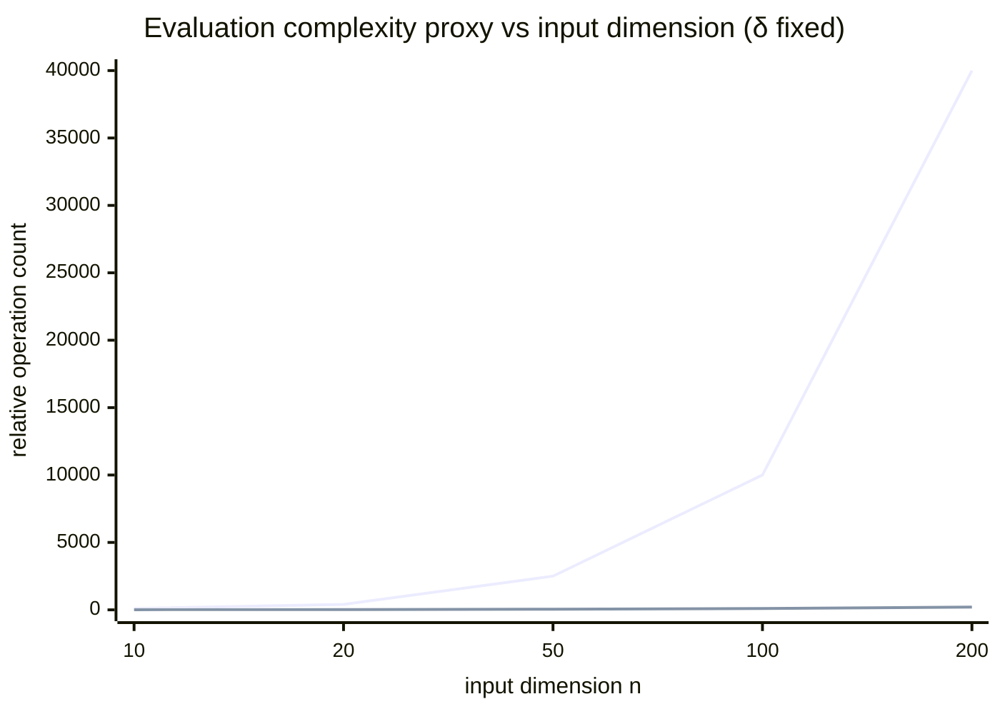

# Hybrid Quantum Approaches for CFD Simulations

## Executive summary

Hybrid quantum computing for CFD currently clusters into three practically distinct families: (i) **Hybrid Quantum Physics‑Informed Neural Networks (Hybrid QPINNs / HQPINNs)** that use parameterized quantum circuits (PQCs) inside PINN-style residual minimization for Navier–Stokes and related flows, (ii) **Quantum DeepONets / Quantum neural operators** that keep *training mostly classical* but aim to accelerate expensive *operator evaluations* with quantum subroutines, and (iii) **Variational spectral PDE solvers packaged in the IBM Qiskit ecosystem**—notably **H‑DES** and the **QUICK‑PDE** Qiskit Function—that encode PDE solutions in spectral bases (e.g., Chebyshev polynomials) and iteratively optimize circuit parameters in a hybrid loop on simulators or hardware. citeturn17view0turn17view9turn13view0turn17view3

Across primary demonstrations, the **most mature “run-on-hardware” path today is QUICK‑PDE/H‑DES**, which is explicitly designed for near-term NISQ devices and exposes tunables like qubits-per-variable, circuit depth, and shot schedules through an IBM-hosted function interface. citeturn13view0turn14view4turn17view6

For **HQPINNs**, published CFD results are still **small‑circuit, proof‑of‑concept**: e.g., a 3‑qubit hybrid quantum PINN for 3D Y‑shaped mixer laminar flow reports ~21% improvement in the PINN loss/accuracy proxy compared with a comparable purely classical model; the same work highlights that classical simulation cost doubles with each added qubit and becomes problematic past ~20 qubits for circuit simulation. citeturn17view2

For **Quantum DeepONet**, the key contribution is an **evaluation-time complexity reduction**: by replacing classical matrix multiplications inside orthogonal-network layers with quantum “pyramidal” circuits (built from RBS gates with unary encoding), the feedforward complexity can scale as **O(n/δ²)** rather than O(n²) in input dimension n (δ: tomography error tolerance). However, **qubit counts scale with input width**, and noise/shot requirements can dominate; in their Qiskit-based noisy studies, backend-noise simulations can inflate errors substantially (e.g., ~14.4% in a simple QOrthoNN experiment with an IBM backend-noise model). citeturn17view8turn17view12turn17view11

A realistic engineering takeaway is that, **for CFD at industrial resolution**, none of these approaches currently displace classical CFD or strong neural-operator baselines (e.g., FNO). The near-term value is in (a) **research into parameter-efficient surrogates** for restricted-flow regimes and (b) **workflow integration experiments** (noise-aware training, hybrid optimization, reduced-order/operator learning, and hardware-aware compilation). citeturn3search1turn22view0turn33view0

## Definitions and theoretical foundations

Hybrid quantum CFD methods combine **classical numerical/ML infrastructure** with **quantum subroutines** (usually PQCs executed with a classical optimizer). The dominant near-term paradigm is **NISQ hybridization**: shallow circuits + repeated measurement + classical optimization and preprocessing. citeturn17view6turn33view0turn22view0

**PINNs (physics‑informed neural networks)** approximate PDE solutions by minimizing a composite loss with data terms (IC/BC/observations) and PDE residual terms evaluated at collocation points. This is the baseline “physics-informed” template that HQPINNs inherit. citeturn3search2turn33view0

**Quantum / Hybrid QPINNs** replace part (or all) of the classical function approximator with a PQC (or insert PQC nodes/layers into a larger network), while still minimizing a physics-informed loss. Hybrid QPINN variants include **serial** quantum modules and **parallel hybrid networks** where a quantum branch and classical branch jointly produce outputs before aggregation. citeturn33view0turn17view0turn25view0

A key theoretical motivation for PQC-based function fitting is that many variational quantum models can be expressed as **(partial) Fourier series in the input data**, with accessible frequencies determined by the data-encoding strategy; richer spectra can be accessed by repeating data encoding (“data re-uploading”). This Fourier structure helps explain observed strengths on smooth/harmonic PDE solutions and difficulties on shock-like discontinuities. citeturn23search0turn25view2

**DeepONet** is a neural-operator architecture that learns mappings between function spaces with a branch net (input function samples) and trunk net (query locations). It is a major classical baseline for operator learning in PDE/CFD surrogate modeling. citeturn3search0turn17view9

**Quantum DeepONet** (as introduced in the Quantum journal work) targets a specific bottleneck: the **forward-pass matrix multiplications** in orthogonal neural networks used inside neural operators. It uses quantum layers (based on RBS gates + unary encoding + tomography-style readout) to reduce evaluation complexity. Training remains primarily classical in their workflow, with quantum simulation/hardware intended mainly for evaluation. citeturn17view8turn17view9turn31view0turn16view4

**H‑DES / QUICK‑PDE** represent a different theoretical foundation: a **spectral approximation** of the PDE solution (e.g., Chebyshev basis) whose coefficients are encoded in quantum-state probabilities/expectation values. PDE solving becomes minimizing a loss over collocation points, where function values and derivatives are extracted from expectation values—avoiding finite-difference derivative approximations and, in their design goal, avoiding an exponential growth in circuits for derivative evaluation. citeturn20view0turn13view0turn4view1

## Hybrid QPINNs for CFD simulations

Two representative HQPINN lines are most directly CFD-focused in the last five years: (a) **3D laminar Navier–Stokes in complex geometry** (Y‑shaped mixer) and (b) **high‑speed compressible flows (Euler/transonic)** with hybrid classical–quantum PINN variants. citeturn17view2turn12view0turn25view3

### Algorithmic architecture and training workflow

A canonical HQPINN workflow (parallel hybrid) looks like this:

```mermaid
flowchart TD
  A[Inputs: (x,y,z,t) + parameters] --> B[Classical feature/MLP trunk]
  A --> C[PQC branch: data encoding + variational layers]
  B --> D[Merge: linear combination / fusion layer]
  C --> D
  D --> E[Outputs: u,v,w,p or derived quantities]
  E --> F[Physics loss: PDE residuals at collocation points]
  E --> G[BC/IC loss & data loss]
  F --> H[Total loss]
  G --> H
  H --> I[Optimizer step: Adam/L-BFGS etc.]
  I --> B
  I --> C
```

This matches the published HQPINN architecture depiction for the 3D Y‑mixer: a classical MLP feeding into a **parallel hybrid network** where a quantum “depth‑infused layer” (variational circuit) and a classical path jointly produce outputs; losses combine PDE residual and boundary-condition constraints, with gradients computed by autodiff/backprop through the classical parts and quantum differentiation methods for the PQC. citeturn17view0turn17view2turn33view0

### Quantum–classical hybridization strategy

In the 3D Y‑mixer HQPINN study, the quantum circuit is **simulated**, and authors explicitly note the training slowdown of simulated quantum circuits; they resort to mini-batching for HQPINN due to training time, and remark that classical simulation runtime roughly doubles per added qubit and becomes significant beyond ~20 qubits. citeturn17view2

In the high-speed-flow HQPINN study (arXiv HTML), models are implemented with **PyTorch + PennyLane**, run on distributed CPUs (no GPU acceleration), and the quantum layer is simulated classically, making it at least **an order of magnitude slower** than a classical layer in wall time. citeturn25view0turn24view1

### Numerical performance and accuracy (reported)

For the 3D Y‑mixer laminar flow case, the HQPINN report states an improvement of **~21%** (loss/accuracy proxy) compared with a comparable purely classical neural configuration, and notes residual artifacts (e.g., asymmetry between outlets potentially tied to data encoding). citeturn17view2

The same source provides baseline classical PINN validation against a reference CFD solver (OpenFOAM) with viscosity sweeps; reported domain-averaged relative errors (pressure, velocity magnitude) vary from a few percent in-range to >20% when extrapolating far from trained regimes. citeturn17view1

For high-speed flows, the paper’s HTML table text provides parameter counts and timings (but not all loss/error numerics are visible in extracted HTML). It reports that small quantum models can be parameter-efficient for smooth/harmonic problems, while shocks/discontinuities degrade quantum-only performance and hybrids typically land between classical-only and quantum-only behavior. citeturn25view2turn25view3turn24view6

A closely related 2025–2026 line—the **Multi-stream Physics Hybrid Network**—targets Navier–Stokes-type test flow structure (Kovasznay flow) by decomposing frequency components, reporting reductions of **36% RMSE in velocity** and **41% in pressure** relative to a comparable classical model with **24% fewer parameters**. citeturn21search0turn21search4

### Scalability and resource estimates (HQPINN family)

The published CFD HQPINN uses a **3‑qubit circuit**, with an encoding layer repeated **d=5** times and a variational layer repeated **m=2** times (gate-level details beyond Ry/CNOT-style descriptions are not fully specified in the paper excerpt). citeturn17view2turn6view1

Noise sensitivity is dominated by (a) the number of entangling operations (typically CNOT-based or hardware entanglers) and (b) measurement-shot noise in expectation-value estimation. The HQPINN CFD paper primarily discusses simulator execution and argues that hardware and parallel acceleration would be needed to extend this regime. citeturn17view2turn33view0

## Quantum DeepONets and quantum neural operators for PDE/CFD

Quantum DeepONet (Quantum journal 2025 paper) is the most complete “primary source” implementation with code released, and includes both **data-driven** and **physics-informed** variants (QPI‑DeepONet). citeturn17view9turn31view0turn16view3

### Architecture and workflow

The core idea is to accelerate a neural operator’s forward pass by constructing **quantum layers** that implement orthogonal matrix multiplications using **reconfigurable beam splitter (RBS) gates** and unary encoding, with classical bias and nonlinearity applied outside the quantum circuit. citeturn17view7turn17view8

Their workflow is explicitly hybrid:

- **Classical training** (e.g., via DeepXDE) on an orthogonal neural network variant.
- Export weights/biases and build a quantum-circuit version of the network that implements the linear transforms via quantum layers.
- **Quantum simulation / (eventual) hardware** evaluation primarily at inference time; in their experiments, this section includes ideal simulation and dedicated noise-model studies using Qiskit. citeturn16view4turn31view0turn17view12

A simplified workflow diagram consistent with the paper:

```mermaid
flowchart LR
  A[Training data / PDE residual definition] --> B[Classical OrthoNN/DeepONet training]
  B --> C[Extract weights/biases]
  C --> D[Build quantum layers (RBS pyramids + unary encoding)]
  D --> E[Quantum DeepONet / QPI-DeepONet evaluation]
  E --> F[Outputs: solution field/operator response]
  E --> G[Optional noise model + error mitigation tests]
```

This matches their documented “classical training + quantum evaluation” positioning, intended to preserve a quadratic evaluation-speed improvement in input dimension. citeturn16view4turn17view8turn31view0

### Hybridization boundary and resource profile

The quantum layer requires **unary state preparation**: for input dimension n and output dimension m, the number of qubits is stated as **1 + max(m,n)** (including an ancilla used for tomography). citeturn17view8

Circuit depth and operations for one quantum layer are analyzed: the depth is **O(n)** (with at most **3n + O(1)** RBS gates for a single layer, in their accounting), and the extraction step requires **O(n/δ²)** measurements (δ: tomography error tolerance). citeturn17view8turn5view10

### Numerical accuracy on PDE benchmarks

The paper includes a consolidated test-error table (“L² relative error”) across several PDE/operator examples. Key entries include:

- **Advection equation:** quantum DeepONet ~2.25% vs classical DeepONet ~1.91% (comparable parameterization).
- **Burgers’ equation:** quantum DeepONet ~1.38% vs classical DeepONet ~1.05% (comparable parameterization). citeturn17view9turn17view10

They also demonstrate QPI‑DeepONet (physics-informed) and discuss hard-constraint boundary-condition embedding (e.g., enforcing Dirichlet constraints by construction). citeturn16view3turn16view4

### Noise sensitivity and mitigation

Noise studies show that simply increasing shots may not help when depolarizing noise dominates; they describe post-selection error mitigation enabled by unary encoding (“keep unary strings, discard others”). citeturn17view8turn15view3

They choose depolarizing parameters λ up to ~2×10⁻³, noting similarity to IBM gate error-rate scales and tabulating sample 1-qubit basis gate error rates across IBM backends. citeturn17view11

A particularly concrete datapoint: in a backend-noise model simulation (Qiskit Aer backend noise for an IBM backend), a simple QOrthoNN experiment can show ~14.4% error, leading them to avoid running that noise model in larger experiments. citeturn17view12

## IBM Qiskit developments for PDE/CFD: QUICK‑PDE and H‑DES

The IBM-hosted QUICK‑PDE documentation is the clearest “engineering-facing” interface in this topic area: it is delivered as a **Qiskit Function** in the IBM Qiskit Functions Catalog and is explicitly positioned for multiphysics PDEs starting with CFD and material deformation. citeturn13view0turn18view2

### QUICK‑PDE definition and workflow

QUICK‑PDE solves PDEs by encoding trial solutions as linear combinations of orthogonal functions—typically **Chebyshev polynomials**—parameterized by a variational circuit; a hybrid loop iteratively updates circuit angles to reduce a PDE-encoded loss. citeturn13view0turn20view0

QUICK‑PDE exposes user parameters including:

- `nb_qubits`: qubits per function and per variable (overrideable),
- `depth`: ansatz depth per function,
- `shots`: shot schedule per optimizer stage (CFD defaults use a staged schedule),
- choice of classical optimizers including CMA‑ES and SciPy optimizers. citeturn14view0turn14view1turn14view2

The documentation also describes a built-in strategy: **stacking 10 identical circuits and evaluating 10 identical observables on different qubits** in a larger circuit to enable a “noise learner” mitigation approach and reduce shots during optimization. (Details of the “noise learner” implementation are not fully specified in the public doc text.) citeturn14view3

### Current CFD benchmark in QUICK‑PDE (as documented)

The current IBM tutorial example applies QUICK‑PDE to **inviscid Burgers’ equation** as a CFD proxy, with a fixed sampling grid and only linear initial conditions of the form ax+b. citeturn13view0turn13view1

The tutorial demonstrates overriding key tunables, e.g.:

- `nb_qubits={"u": {"t": 2, "x": 1}}`,
- `depth={"u": 3}`,
- `shots=[500, 2500, 5000, 10000]`,
- switching initialization strategy and specifying backend/mode. citeturn14view4turn14view5turn14view6

### H‑DES theoretical foundation and scaling claims

The underlying algorithmic paper **H‑DES** is a variational, hybrid quantum–classical differential-equation solver based on spectral decomposition. It emphasizes:

- **Chebyshev spectral expansions** (though other bases are possible),
- derivative extraction via expectation values of variable-dependent observables,
- shallow circuits to mitigate decoherence/gate noise,
- complexity accounting for preprocessing, expectation evaluation, and classical optimization steps. citeturn20view0turn17view3turn4view1

Encoding (1D) is explicitly written as:
\[
f(x)=\lambda \sum_{i=0}^{2^{n-1}-1}\left(p_i - p_{i+2^{n-1}}\right)\,\mathrm{Cheb}(i,x),
\]
so the effective Chebyshev mode count is **2^(n−1)** in their sign-splitting convention. citeturn20view0turn20view3

Scaling observations that matter for CFD-like multivariate PDEs:

- Increasing qubits increases representational capacity exponentially (more Chebyshev polynomials), but increases parameters linearly and impacts BFGS-like optimizers (quadratically in parameter count, in their discussion). citeturn17view4turn16view6  
- “With six (or seven) qubits” they report retrieving a spectral basis of size **32 (or 64)**, framed as sufficient for many smooth functions. citeturn20view3  
- In multivariate settings, qubit requirements grow **linearly with the number of dimensions**, and they argue dimensions are typically capped by 3D+time (~4 variables). citeturn17view6turn20view1  

### Demonstrated resource usage on real hardware (H‑DES paper)

A concrete “run-on-hardware” example in H‑DES solves a first-order ODE on an IBM backend:

- **3 qubits**, **depth 2** ansatz (Ry + cascaded CNOT),
- **20 optimizer iterations**, **20,000 shots per iteration**,
- executed on IBM backend “Brisbane” (Jan 2025 in the paper) and transpiled with Qiskit 1.2.4,
- final loss reported as **0.052** (validation score also reported). citeturn17view6turn20view4

These specifics matter because they anchor many “resource estimate” discussions in realistic NISQ operating conditions (shots dominate wall time; depth and entanglers constrain noise). citeturn17view6turn22view0

## Comparative analysis: architectures, resources, benchmark results, and experiment designs

### Comparison table of methods

| Method family | What is “quantum” | Train/eval split | Best-fit CFD use case today | Primary claimed advantage | Primary sources |
|---|---|---|---|---|---|
| Hybrid QPINNs / HQPINNs (parallel hybrid networks) | PQC module(s) embedded in PINN network; expectation outputs fused with classical outputs | Training requires repeated circuit evals (often simulated today); inference similar | Low-Re laminar flows, smooth regimes; geometry-parameterized surrogates | Potential parameter efficiency / expressivity; modest accuracy gains shown in small demos | citeturn17view0turn17view2turn33view0 |
| Multi-stream hybrid QPINN derivative | Multiple parallel hybrid nets each learning separated frequency bands | Train requires multiple hybrid modules | Analytic/benchmark Navier–Stokes flows (e.g., Kovasznay) | Fewer parameters + better RMSE vs comparable classical baseline | citeturn21search0turn21search4 |
| Quantum DeepONet / QPI-DeepONet | Quantum orthogonal layers for matrix multiplication (RBS pyramids + unary encoding) | **Classical training**, quantum intended for **evaluation** | Operator learning for repeated evaluations (surrogates, inverse loops); not yet large CFD grids due to qubit scaling | Quadratic evaluation complexity reduction w.r.t. input width (subject to tomography/δ) | citeturn17view8turn17view9turn31view0 |
| Variational spectral PDE solvers (H‑DES / QUICK‑PDE) | Circuit encodes spectral coefficients; observables compute f & derivatives; hybrid optimizer loop | Quantum used inside optimization loop; classical does preprocessing, loss aggregation, and optimization orchestration | Low-dimensional PDEs; structured domains; early CFD proxies like Burgers; expand toward multiphysics | Compact representation: exponential modes vs qubits (basis), with shallow circuits | citeturn13view0turn20view0turn17view6 |
| Hybrid CFD via quantum linear solvers (not a PINN/operator) | Quantum linear algebra subroutines inserted into implicit CFD solvers | Classical CFD does discretization & Newton steps; quantum solves LAS portion | Implicit finite-volume CFD where linear system solve dominates | Potential accelerator role (QLS as “QPU linear solver engine”) | citeturn30view0turn29search0 |

### Resource and complexity estimates (with “unspecified” where not given)

| Approach | Demonstrated qubits | Demonstrated depth / structure | Measurement cost driver | Noted noise sensitivity | Where quantum runs |
|---|---:|---|---|---|---|
| HQPINN for 3D Y‑mixer | 3 qubits citeturn17view2 | Encoding repeated d=5; variational repeated m=2; Ry/CNOT-style described citeturn17view2 | Shots for expectation values (unspecified); simulator cost doubles per qubit citeturn17view2 | Encoding artifacts; entanglers and depth increase noise risk (qualitative) citeturn17view2 | Simulator (paper) citeturn17view2 |
| HQPINN for high-speed flows | 3 qubits (qq models) with 2–4 layers; also 4‑qubit circuit referenced for design citeturn24view6turn12view0 | Alternating feature-map + ansatz layers; Pauli‑Z measurements citeturn12view0 | Classical simulation wall time (≥10× slower than classical layer) citeturn25view0 | Poor trainability under shocks; under-parameterized PQC harms hybrid trainability citeturn25view3 | Simulator (paper) citeturn25view0 |
| Quantum DeepONet quantum layer | 1+max(m,n) qubits (includes ancilla) citeturn17view8 | O(n) depth; ≤3n+O(1) RBS gates for one layer (per their counting) citeturn17view8 | Tomography/readout scaling O(n/δ²); finite-sampling error ∝ N_shot^-0.5 citeturn17view8turn17view12 | Depolarizing + backend-noise; post-selection mitigates some noise but reduces usable shots citeturn17view8turn17view12 | Qiskit simulation (paper); hardware intended for eval citeturn16view4turn31view0 |
| H‑DES / QUICK‑PDE | H‑DES hardware demo: 3 qubits citeturn17view6; emulator ex: 4 qubits citeturn17view5 | Hardware-efficient ansatz (Ry + CNOT layers); per extra qubit per layer: add rotation + CNOT citeturn20view4turn17view4 | Expectation values for many observables across sample points; shots per iteration can be large (e.g., 20k) citeturn17view6 | CNOT/entanglers and depth increase noise; emphasis on shallow circuits citeturn20view4turn17view4 | Hardware + simulators via IBM/Qiskit interface citeturn13view0turn17view6 |
| QUICK‑PDE tutorial config | Example: t:2 qubits, x:1 qubit (u) citeturn14view4 | Example depth=3; multi-stage shot schedule [500…10000] citeturn14view4turn14view6 | Hybrid optimization (CMA stages) repeated circuit invocations; final_loss shown <0.0015 in example citeturn14view6 | Suggests noise-mitigation via circuit stacking/noise learner citeturn14view3 | IBM QPU backend selection (tutorial shows) citeturn14view4turn14view5 |

### Representative benchmark results table (reported)

| Method | Benchmark problem | Metric reported | Reported result | Baseline / comparison |
|---|---|---:|---:|---|
| HQPINN (3D Y‑mixer) | Laminar flow in 3D Y‑shaped mixer (Navier–Stokes PINN) | Loss/accuracy proxy improvement | ~21% improvement vs purely classical model (reported) citeturn17view2 | Classical model w/ similar architecture citeturn17view2 |
| Classical PINN baseline in same study | Viscosity sweep vs reference CFD | Relative errors (domain-avg) | Example: ν=2 → p err 2.7%, \|\|v\|\| err 1.5%; ν=10 → p err 21.0%, \|\|v\|\| err 24.6% citeturn17view1 | Reference OpenFOAM solution citeturn17view1 |
| Multi-stream hybrid network | Kovasznay flow | RMSE reduction | 36% (velocity), 41% (pressure), 24% fewer params vs classical citeturn21search0turn21search4 | Multi-stream classical baseline citeturn21search0 |
| Quantum DeepONet | Advection equation operator | L² relative error | Quantum: 2.25%; classical DeepONet: 1.91% citeturn17view9turn17view10 | Comparable parameter budget citeturn17view9 |
| Quantum DeepONet | Burgers equation operator | L² relative error | Quantum: 1.38%; classical DeepONet: 1.05% citeturn17view9turn17view10 | Comparable parameter budget citeturn17view9 |
| QUICK‑PDE tutorial | Inviscid Burgers equation | Final loss in example run log | final_loss ≈ 0.00152 (example; after staged CMA sequence) citeturn14view6 | Not directly compared in tutorial text (unspecified) citeturn14view6 |
| H‑DES hardware demo | 1st-order ODE f′−f=0 on [0,0.91] with f(0)=1 | Final loss | final loss 0.052 (3 qubits, depth 2, 20 iters, 20k shots) citeturn17view6 | Compared to analytic solution; validation score reported citeturn17view6 |

### A chart: performance proxy vs problem size

The following is **not a hardware timing benchmark**; it’s a proxy showing how evaluation complexity scales with operator input dimension n for classical vs quantum-accelerated orthogonal layers (δ fixed), based on the complexity comparison in the Quantum DeepONet work. citeturn17view8turn15view1



### Suggested CFD benchmark experiments (rigorous designs)

The experiments below are designed to make **hybrid quantum claims falsifiable** under realistic constraints: small qubit counts, noisy evaluation, and strong classical baselines.

**Laminar incompressible Navier–Stokes: Kovasznay flow (2D, analytic reference).**  
Use Kovasznay as a controlled test where exact velocity/pressure are known (and already used by multi-stream hybrid work). Design: compare (i) classical PINN, (ii) HQPINN parallel hybrid, (iii) multi-stream hybrid. Metrics: L² error for u,v,p; divergence norm; PDE residual statistics; parameter counts and wall time (CPU, GPU if used). Conduct ablation in qubits (2–8), depth (1–6), and entanglement topology (linear vs all-to-all emulator). citeturn21search0turn33view0

**Laminar external flow: 2D cylinder wake, Re≈100 (vortex shedding).**  
Use an NSFnet/PINN-style formulation (velocity–pressure or vorticity–velocity) as baseline. Training: collocation sampling in space–time; evaluate generalization to shifted Reynolds numbers. HQPINN can be used as (a) parallel hybrid add-on to a classical PINN trunk or (b) quantum-only QPINN. Metrics: time-dependent L² errors, Strouhal number, integrated forces (lift/drag), and stability of training (gradient pathology incidence). citeturn3search3turn33view0

**Operator-learning surrogate for moderate-resolution Navier–Stokes.**  
Use a neural-operator baseline such as FNO and DeepONet for learning the operator mapping from initial conditions (or forcing) to solution snapshots (or next time step). Then test Quantum DeepONet in the same operator-learning setting but with **compressed sensor sets/PCA** that keep input dimension in the quantum-feasible regime (e.g., n≤16–32). Report operator generalization error and evaluation throughput under (i) ideal statevector simulation, (ii) shot-based noisy simulation. citeturn3search1turn3search0turn17view9turn16view4

**Shock-containing compressible flows: 1D Euler discontinuity + 2D transonic airfoil (NACA0012).**  
The high-speed-flow HQPINN study suggests quantum-only models struggle with discontinuities; use their setup as a reproducibility target. Add explicit shock-handling PINN add-ons (coordinate transforms, adaptive residual weights, artificial viscosity) and quantify whether hybrid quantum components still meaningfully contribute once classical shock sensors are present. Metrics: shock location error, pressure coefficient distribution, and compute cost (s/epoch) separating quantum vs classical evaluation time. citeturn25view3turn25view0

**PDE-solver pathway: Burgers (viscous/inviscid) as a unifying benchmark across families.**  
Burgers is shared by QUICK‑PDE tutorials and Quantum DeepONet benchmarks. Design: fix identical discretization and initial condition ensembles (for operator learning) and compare: (i) QUICK‑PDE (loss vs shots/qubits/depth), (ii) Quantum DeepONet (operator error vs n and noise), (iii) classical DeepONet/FNO baselines. This enables direct cross-method comparisons beyond “each paper’s custom setup.” citeturn13view1turn17view10turn3search1

## Limitations, open challenges, and research directions

**Data loading / dimensionality bottlenecks.**  
Quantum DeepONet’s unary encoding makes qubit count scale with input width; this is structurally misaligned with CFD, where even reduced sensor grids can be large. Practical quantum operator-learning for CFD likely requires stronger dimensionality reduction, alternative encodings, or fault-tolerant regimes. citeturn17view8turn16view4turn3search1

**Noise, shot cost, and optimizer behavior.**  
Shot noise (finite sampling) and hardware noise can dominate; increasing shots alone does not necessarily help when depolarizing/relaxation noise dominates, and error mitigation can reduce “usable shots.” Hybrid PDE solvers and HQPINNs therefore face a fundamental throughput vs fidelity trade-off. citeturn17view12turn17view6turn14view3

**Trainability pathologies (barren plateaus / local minima).**  
The Quantum DeepONet paper flags trainability issues and the need to manage measurement-shot growth; the HQPINN CFD and high-speed-flow studies similarly emphasize practical trainability constraints and the heavy cost of quantum simulation. Research directions: structured ansätze (orthogonal/networks, spectral biases), layerwise training, frequency-aware hybrid decomposition, and hardware-aware compilation that limits entanglers. citeturn4view2turn17view2turn21search0

**Scope of PDEs solved in “productized” Qiskit Functions.**  
QUICK‑PDE’s documented CFD case is currently Burgers with restricted initial conditions and a fixed grid; it is best viewed as an integration testbed rather than “Navier–Stokes on hardware.” An important open path is extending the function interface to broader PDE classes (multi-field Navier–Stokes, turbulence closures, irregular domains) and publishing clearer, reproducible benchmarks. citeturn13view0turn13view1

**Reproducibility and benchmark standardization.**  
Quantum DeepONet is unusually strong here (open GitHub code + datasets + scripts). Many HQPINN CFD demos do not ship full pipelines, complicating independent evaluation. A near-term research priority is to standardize CFD-like benchmark suites shared across methods, including identical IC/BC ensembles and consistent error metrics. citeturn31view0turn17view2

**Hybrid CFD via quantum linear solvers is conceptually attractive but heavy.**  
The hybrid finite-volume + quantum linear solver framework is closer to “traditional CFD acceleration,” but it typically inherits hard requirements of quantum linear algebra (state prep/readout, conditioning, tomography). Its viability depends on whether subspace-embedded / variational QLS methods can deliver useful accuracy under realistic qubit/shot limits. citeturn30view0turn29search26turn22view0

## Implementation notes, Qiskit APIs, code pointers, and URLs

### Qiskit primitives and execution boundary (what runs where)

On IBM hardware, **SamplerV2 / EstimatorV2** primitives are the standard execution interfaces; V2 primitives require **ISA-compatible circuits and observables** and do not perform routing/layout implicitly, so transpilation must be handled explicitly (e.g., preset pass managers) before submission. citeturn13view3turn22view0turn18view3

Qiskit Runtime provides built-in **error suppression and error mitigation** features (e.g., dynamical decoupling, readout mitigation, ZNE, PEC) and can use additional classical compute resources near the QPU to make this practical. citeturn22view0

### QUICK‑PDE (Qiskit Function) minimal usage pattern

From the IBM tutorial, the typical flow is:

```python
from qiskit_ibm_catalog import QiskitFunctionsCatalog

catalog = QiskitFunctionsCatalog(
    channel="ibm_quantum_platform",
    instance="INSTANCE_CRN",
    token="YOUR_API_KEY",
)
quick = catalog.load("colibritd/quick-pde")

job = quick.run(
    use_case="cfd",
    physical_parameters={"a": 1.0, "b": 1.0},
)

# Optional: tune hardware parameters
job_2 = quick.run(
    use_case="cfd",
    physical_parameters={"a": 0.5, "b": 0.25},
    nb_qubits={"u": {"t": 2, "x": 1}},
    depth={"u": 3},
    shots=[500, 2500, 5000, 10000],
    initialization="RANDOM",
    backend="ibm_kingston",
    mode="session",
)
result = job_2.result()
```

This call surface matters for researchers because it exposes experimental levers (qubits per variable, depth, shots, backend selection) that map directly onto resource studies and noise sensitivity analysis. citeturn13view1turn14view4turn14view6

### Qiskit Machine Learning: building PQC “layers” for HQPINN prototypes

If you implement HQPINNs directly in Qiskit rather than PennyLane, Qiskit Machine Learning provides:

- `SamplerQNN`, `EstimatorQNN` as PQC-backed neural-network primitives,
- `QNNCircuit` to compose a feature map + ansatz without manual circuit composition,
- `NeuralNetworkRegressor` / `NeuralNetworkClassifier` wrappers. citeturn19view2turn18view5turn0search31

Example interface (from release notes):

```python
from qiskit_machine_learning.circuit.library import QNNCircuit
from qiskit_machine_learning.neural_networks import SamplerQNN

def parity(x):
    return f"{bin(x)}".count("1") % 2

qnn_qc = QNNCircuit(num_qubits=2)
qnn = SamplerQNN(circuit=qnn_qc, interpret=parity, output_shape=2)
```

Recent releases emphasize alignment with **Qiskit 2.0 and V2 primitives**, enabling direct execution using `EstimatorV2` / `SamplerV2` on IBM backends. citeturn19view1turn19view2

### Quantum DeepONet reference code

Quantum DeepONet is one of the few projects in this space with end-to-end released code and data generation scripts. The repository documents:

- dataset generation scripts for antiderivative, Poisson, advection, Burgers,
- training scripts using **DeepXDE** (v1.10.1 stated),
- post-training simulation scripts using **Qiskit**. citeturn31view0turn16view4turn17view9

### Practical recommendations for researchers/engineers

1) **Start with Burgers and Kovasznay** as shared benchmarks; they are already used across QUICK‑PDE and quantum neural-operator literature and let you quantify shot/noise trade-offs before attempting Navier–Stokes turbulence. citeturn13view1turn21search0turn17view10

2) **Treat “qubits × depth × shots” as first-class experimental variables**, not implementation details. For NISQ solvers, these directly determine accuracy, wall time, and failure modes; QUICK‑PDE exposes them explicitly and provides a ready integration path to hardware. citeturn14view4turn14view6turn22view0

3) **Use a strong classical surrogate baseline** (FNO, DeepONet, classical PINN variants) and report: parameter counts, wall time, and error vs resolution. Without this, “quantum advantage” narratives will likely be misleading. citeturn3search1turn3search0turn3search3

4) **For shocks/discontinuities, assume quantum-only PQCs will struggle unless you add structure** (hybrid classical fallback branches, multistream frequency splitting, or shock-aware PINN augmentation). citeturn25view2turn21search0

5) **If your target is repeated evaluation in an outer loop** (design optimization, Bayesian inversion, adjoints), Quantum DeepONet-like approaches are conceptually aligned—*but your dimension reduction must be aggressive enough to fit qubit budgets*, and you must measure end-to-end cost including readout/tomography. citeturn17view8turn16view4turn3search1

### Source URLs (as requested)

```text
Primary papers / preprints
- HQPINN for CFD in complex shapes (Mach. Learn.: Sci. Technol. 2024): https://arxiv.org/abs/2304.11247
- H-DES (Hybrid Differential Equation Solver) preprint: https://arxiv.org/abs/2410.01130
- Quantum DeepONet (Quantum journal / arXiv): https://arxiv.org/abs/2409.15683
- Multi-stream Physics Hybrid Networks for Navier–Stokes (Kovasznay): https://arxiv.org/abs/2504.01891
- Hybrid quantum-classical CFD framework (quantum linear solvers + FVM): https://arxiv.org/abs/2406.16595
- PINNs foundational paper (JCP 2019 preview page): https://www.sciencedirect.com/science/article/pii/S0021999118307125
- DeepONet original (arXiv): https://arxiv.org/abs/1910.03193
- Fourier Neural Operator (arXiv): https://arxiv.org/abs/2010.08895
- PQCs as Fourier series (Schuld et al., arXiv): https://arxiv.org/abs/2008.08605

IBM Qiskit documentation (QUICK-PDE / Functions / Primitives)
- QUICK-PDE guide: https://quantum.cloud.ibm.com/docs/guides/colibritd-pde
- QUICK-PDE tutorial: https://quantum.cloud.ibm.com/docs/tutorials/colibritd-pde
- Qiskit Functions guide: https://quantum.cloud.ibm.com/docs/guides/functions
- V2 primitives migration guide: https://quantum.cloud.ibm.com/docs/guides/v2-primitives
- EstimatorV2 API: https://quantum.cloud.ibm.com/docs/api/qiskit-ibm-runtime/estimator-v2

Code repositories
- Quantum DeepONet code: https://github.com/lu-group/quantum-deeponet
- Qiskit Machine Learning: https://github.com/qiskit-community/qiskit-machine-learning
- Qiskit IBM Runtime client: https://github.com/Qiskit/qiskit-ibm-runtime

Qiskit Machine Learning docs
- SamplerQNN API: https://qiskit-community.github.io/qiskit-machine-learning/stubs/qiskit_machine_learning.neural_networks.SamplerQNN.html
- Qiskit ML releases (V2 primitives support): https://github.com/qiskit-community/qiskit-machine-learning/releases
- Neural network classifier/regressor tutorial: https://qiskit-community.github.io/qiskit-machine-learning/tutorials/02_neural_network_classifier_and_regressor.html
```
